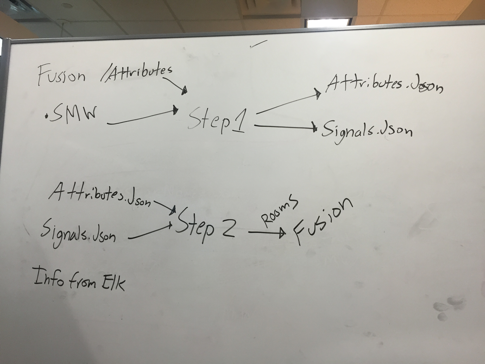

# touchpanel-update-runner


### Installation
You'll need the following ENV variables set on your machine to test and develop locally:
```
export FTP_MICROSERVICE_ADDRESS="http://avmetrics1.byu.edu:8002"
export WAIT_FOR_REBOOT_MICROSERVICE_ADDRESS="http://avmetrics1.byu.edu:8003"
export TELNET_MICROSERVICE_ADDRESS="http://avmetrics1.byu.edu:8001"
export TOUCHPANEL_UPDATE_RUNNER_ADDRESS="http://10.5.34.118:8000"
export ELASTICSEARCH_ADDRESS="http://search-byu-oit-av-metrics-ruenjnrqfuhghh7omvtmgcqe7m.us-west-1.es.amazonaws.com/tpupdates/"
```

### Usage
```
{
    "Info": [{
        "Type": [
            "TECHD"
        ],
        "Address": "10.6.36.54",
        "Force": false
    }],
    "HDConfiguration": {
        "FirmwareLocation": "D:/Firmware/hdfirm.puf",
        "ProjectLocation": "D:/Firmware/TECHD.vtz",
        "FirmwareVersion": "1.501.0013",
        "ProjectDate": "March 29, 2016 8:27:32"
    }
}
```

### Notes

